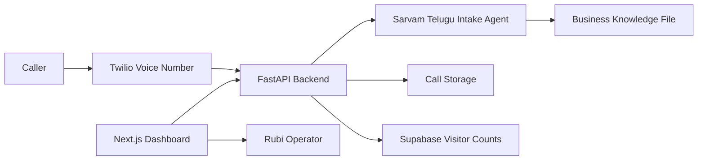

# Rubi

Rubi is an AI voice-intake platform for web-development businesses. It answers inbound calls through Twilio, collects lead information, records conversations, stores readable call notes, and exposes an operator dashboard for reviewing calls, transcripts, recordings, lead state, visitor counts, and deployment configuration.

The current repository is an MVP-grade monorepo designed to be easy to run locally, deploy through Vercel Services, and extend into a production voice-agent platform.

## Product Capabilities

- Inbound phone-call handling with Twilio Voice webhooks.
- Sarvam-backed Telugu website-development consultant flow for Rubicorn Technologies.
- Pure Telugu call prompts with Sarvam Telugu text-to-speech.
- Lead capture for name, phone number, requirement, budget, and agreement state.
- Call recording callback support and dashboard playback links.
- Chat-style transcript view per caller.
- Dashboard pages for calls, history, live calls, analytics, knowledge, agent behavior, tools, settings, users, voices, models, logs, security, and telephony.
- Responsive desktop and mobile UI with fixed desktop sidebar, mobile bottom navigation, and hamburger overflow menu.
- Supabase-backed visitor counting with daily and total counts.
- Deployment-ready Vercel Services configuration for frontend and backend.

## Repository Structure

```text
Rubi/
  backend/                 FastAPI backend, Twilio webhooks, call storage, visitor APIs
  frontend/                Next.js dashboard application
  agents/                  Agent contracts and conversation manager primitives
  providers/               LLM, STT, and TTS provider interfaces
  telephony/               Telephony provider abstractions
  voice/                   Voice pipeline contracts
  memory/                  Memory/profile storage contracts
  knowledge/               Knowledge search contracts
  plugins/                 Tool/plugin contracts
  docs/                    Architecture, telephony, deployment, and business knowledge docs
  supabase/schema.sql      Supabase visitor tracking schema
  vercel.json              Vercel Services deployment configuration
```

## Architecture

Rubi is split into a Next.js dashboard and a FastAPI backend.



### Frontend

The frontend is a Next.js App Router application in `frontend/`.

Important areas:

- `frontend/src/app/page.tsx`: main call intake dashboard.
- `frontend/src/app/calls/page.tsx`: all call records.
- `frontend/src/app/calls/[id]/page.tsx`: chat-style call detail and recording playback.
- `frontend/src/components/app-shell.tsx`: desktop/mobile navigation shell.
- `frontend/src/components/visitor-counter.tsx`: bottom-left visitor counter.
- `frontend/src/lib/api.ts`: deployment-safe API URL resolution.

### Backend

The backend is a FastAPI application in `backend/`.

Important areas:

- `backend/app/main.py`: FastAPI app, CORS, health check, API router.
- `backend/app/api/v1/routers/twilio.py`: Twilio Voice and recording callbacks.
- `backend/app/api/v1/routers/calls.py`: call listing, detail, and recording proxy.
- `backend/app/api/v1/routers/visits.py`: visitor stats endpoints.
- `backend/app/services/intake_agent_service.py`: Sarvam-backed web-development intake flow.
- `backend/app/services/sarvam_agent_service.py`: Telugu-only Sarvam chat behavior.
- `backend/app/services/sarvam_tts_service.py`: Sarvam Telugu voice generation for Twilio playback.
- `backend/app/services/twilio_service.py`: Twilio-specific call orchestration.
- `backend/app/services/storage_service.py`: call record persistence.
- `backend/app/services/visitor_service.py`: Supabase visitor count management.

## Runtime Flow

1. A caller calls the configured Twilio number.
2. Twilio sends an inbound voice webhook to Rubi.
3. Rubi responds with TwiML and starts the guided intake.
4. The caller answers prompts for requirement, budget, and agreement.
5. Rubi stores the transcript turns, summary, lead details, and agreement state.
6. Twilio posts recording metadata after the call.
7. The dashboard displays the call, transcript, lead fields, and recording playback.

## Local Development

### Prerequisites

- Node.js 20+
- Python 3.12+
- Git
- A Twilio account for live phone testing
- A Supabase project for visitor count persistence

### Clone And Install

```bash
git clone https://github.com/nxtgensec/Rubi.git
cd Rubi
```

Backend:

```powershell
python -m venv .venv
.\.venv\Scripts\activate
pip install -r backend/requirements.txt
```

Frontend:

```bash
cd frontend
npm install
```

### Environment Setup

Create a local `.env` from the template:

```powershell
copy .env.example .env
```

Set the values you need for local Twilio/Supabase testing:

```text
NEXT_PUBLIC_API_URL=http://127.0.0.1:8002
PUBLIC_BACKEND_URL=https://your-public-tunnel.example
TWILIO_ACCOUNT_SID=
TWILIO_AUTH_TOKEN=
TWILIO_PHONE_NUMBER=
SUPABASE_URL=
SUPABASE_SERVICE_ROLE_KEY=
SARVAM_API_KEY=
SARVAM_CHAT_MODEL=sarvam-30b
SARVAM_TTS_MODEL=bulbul:v3
SARVAM_TTS_SPEAKER=kavitha
```

Never commit `.env`. It is intentionally ignored.

### Start Backend

```powershell
cd backend
$env:PYTHONPATH="."
..\.venv\Scripts\python.exe -m uvicorn app.main:app --host 127.0.0.1 --port 8002 --reload
```

From the repository root, the equivalent command is:

```powershell
.\.venv\Scripts\python.exe -m uvicorn app.main:app --app-dir backend --host 127.0.0.1 --port 8002 --reload
```

Backend health:

```text
http://127.0.0.1:8002/health
```

### Start Frontend

```bash
cd frontend
npm run dev
```

Dashboard:

```text
http://127.0.0.1:3000
```

## Supabase Setup

Rubi uses Supabase for website visitor counts.

Run the SQL in:

```text
supabase/schema.sql
```

It creates:

- `visitor_daily_counts`
- `visitor_events`

The backend uses the Supabase service-role key server-side to insert and reconcile visitor counts. Do not expose the service-role key in browser-visible variables.

## Twilio Setup

For local phone testing, your backend must be publicly reachable. Use a tunnel such as Cloudflare Tunnel or another HTTPS tunnel.

Configure Twilio Voice webhook:

```text
POST https://your-public-backend.example/api/v1/twilio/voice
```

Recording callback:

```text
POST https://your-public-backend.example/api/v1/twilio/recording
```

For Vercel Services deployment, the webhook becomes:

```text
POST https://your-vercel-domain.vercel.app/_/backend/api/v1/twilio/voice
```

Update Twilio only after the live backend health check passes.

## Vercel Deployment

This repo includes `vercel.json` for Vercel Services:

```json
{
  "experimentalServices": {
    "frontend": {
      "entrypoint": "frontend",
      "routePrefix": "/",
      "framework": "nextjs"
    },
    "backend": {
      "entrypoint": "backend/app/main.py",
      "routePrefix": "/_/backend",
      "framework": "fastapi"
    }
  }
}
```

### Vercel Import Settings

- Repository: `nxtgensec/Rubi`
- Branch: `main`
- Root Directory: `./`
- Application Preset: `Services`

### Frontend Environment Variables

```text
NEXT_PUBLIC_API_URL=/_/backend
```

This is safe because it is only a public route prefix. Do not put secrets in `NEXT_PUBLIC_` variables.

### Backend Environment Variables

Set these in Vercel Project Settings:

```text
PUBLIC_BACKEND_URL=https://your-vercel-domain.vercel.app/_/backend
PUBLIC_VOICE_STREAM_BASE_URL=wss://your-vercel-domain.vercel.app/_/backend/voice
TWILIO_ACCOUNT_SID=
TWILIO_AUTH_TOKEN=
TWILIO_PHONE_NUMBER=
SUPABASE_URL=
SUPABASE_SERVICE_ROLE_KEY=
CORS_ORIGINS=["https://your-vercel-domain.vercel.app"]
```

### Deploy Checklist

1. Deploy from GitHub to Vercel.
2. Confirm backend health:

   ```text
   https://your-vercel-domain.vercel.app/_/backend/health
   ```

3. Confirm the dashboard loads.
4. Confirm visitor counter shows live Supabase counts.
5. Update Twilio voice webhook to:

   ```text
   https://your-vercel-domain.vercel.app/_/backend/api/v1/twilio/voice
   ```

6. Make one test call.
7. Verify transcript, lead details, agreement state, and recording playback.

## API Overview

Base path:

```text
/api/v1
```

Key endpoints:

| Method | Endpoint | Purpose |
| --- | --- | --- |
| `GET` | `/health` | Backend health check |
| `GET` | `/api/v1/calls` | List stored calls |
| `GET` | `/api/v1/calls/{id}` | Get one call with transcript and lead details |
| `GET` | `/api/v1/calls/{id}/recording` | Proxy/play a Twilio recording |
| `POST` | `/api/v1/twilio/voice` | Twilio inbound voice webhook |
| `POST` | `/api/v1/twilio/recording` | Twilio recording callback |
| `GET` | `/api/v1/visits` | Visitor stats |
| `POST` | `/api/v1/visits` | Record visitor event |

When deployed through Vercel Services, prefix backend URLs with `/_/backend`.

Example:

```text
/_/backend/api/v1/calls
```

## Dashboard Navigation

Desktop:

- Fixed left sidebar.
- Route-based navigation.

Mobile:

- Bottom navigation for top five routes.
- Hamburger menu for secondary routes.

Primary mobile routes:

- Dashboard
- Calls
- History
- Analytics
- Telephony

Beta routes are intentionally marked in the UI when the feature is partially implemented or still under testing.

## Business Knowledge

Rubi answers website-development questions from:

```text
docs/business_knowledge.md
```

Update this file with real business details:

- Services
- Packages
- Pricing guidance
- Delivery process
- FAQs
- Contact and escalation rules

If Rubi does not know an answer, the intended behavior is to apologize and tell the caller the team will get back with details.

## Testing And Verification

Backend tests:

```powershell
$env:PYTHONPATH="backend"
.\.venv\Scripts\pytest.exe
```

Frontend build:

```bash
cd frontend
npm run build
```

Recommended pre-deploy checks:

- Confirm no secrets are committed.
- Confirm `NEXT_PUBLIC_API_URL` points to `/_/backend` on Vercel.
- Confirm Supabase tables exist.
- Confirm Twilio webhook points to the current live backend.
- Make one full test call and verify dashboard output.

## Security Notes

- Never commit `.env`.
- Never expose `TWILIO_AUTH_TOKEN` to the browser.
- Never expose `SUPABASE_SERVICE_ROLE_KEY` to the browser.
- Rotate any secret that was shared outside a secret manager.
- Put only public config in `NEXT_PUBLIC_` variables.
- Keep Twilio webhook updates as the final deployment step.
- Add dashboard authentication before using this for sensitive production call data.

## Current MVP Limitations

- The call agent uses Sarvam for dynamic Telugu intake, but it stays scoped to web-development conversations.
- Telugu voice playback is generated through Sarvam TTS; production-grade live STT tuning still depends on Twilio speech capture quality.
- Some dashboard sections are marked Beta while deeper admin workflows are being built.
- Call storage currently has local-file behavior in the backend service; production should move all call records to Supabase/Postgres.
- Dashboard authentication and multi-user roles are not fully implemented.
- Long-running real-time voice streaming may need a dedicated always-on backend if the flow grows beyond webhook-style call handling.

## Roadmap

- Supabase/Postgres persistence for all call records and transcripts.
- Authenticated dashboard with user roles.
- Editable knowledge base from the UI.
- More natural Telugu voice support.
- Full analytics and filtering.
- Live call monitoring.
- Human handoff and team assignment.
- Production observability and alerting.

## License

This project is currently private/product MVP code. Add a license before public open-source distribution.
