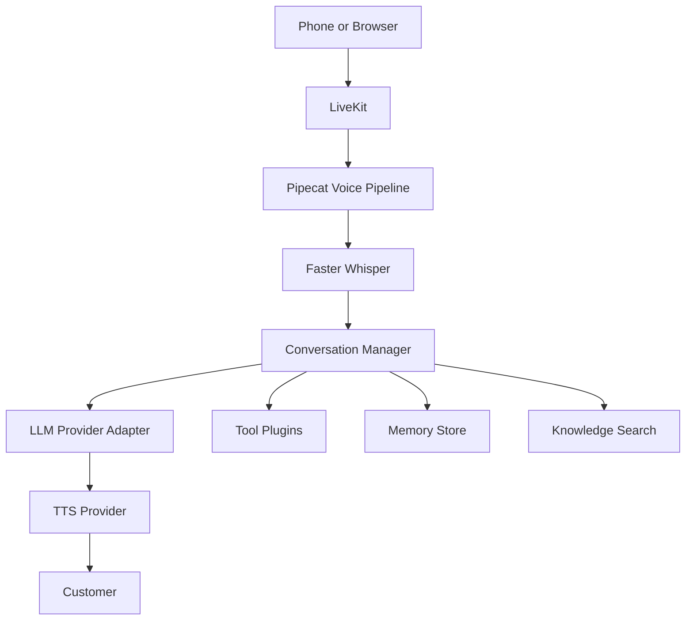

# Rubi Architecture

Rubi is split into product modules that communicate through API calls and events.

## Runtime Modules

- `backend`: FastAPI API, auth, orchestration endpoints, service layer, event stream, and future workers.
- `frontend`: Next.js dashboard for calls, knowledge, agents, analytics, tools, settings, users, voices, models, and logs.
- `voice`: Browser and LiveKit/Pipecat voice pipeline contracts. This module owns streaming STT, VAD, interruptions, silence detection, and streaming TTS.
- `agents`: Agent definitions and conversation state management.
- `providers`: LLM, STT, and TTS provider interfaces.
- `telephony`: SIP, Asterisk, Twilio, Exotel, and future phone provider contracts.
- `memory`: Caller profile, preferences, conversation summaries, previous calls, language, and lead status.
- `knowledge`: Document ingestion, chunking, embedding, indexing, and search contracts.
- `plugins`: Business action tool interface.

## Event Flow

## Event Names

- `CallStarted`
- `CallEnded`
- `TranscriptReceived`
- `UserInterrupted`
- `LLMStarted`
- `LLMCompleted`
- `ToolStarted`
- `ToolCompleted`
- `TTSStarted`
- `TTSCompleted`
- `MemoryUpdated`

## Phase 1 Boundary

Phase 1 should ship browser voice chat, dashboard workflows, provider contracts, knowledge upload metadata, tool registry, memory contracts, and simple event streaming.

## Phase 2 Boundary

Phase 2 should add production telephony, call recording, transfer, SIP provider setup, background workers, durable database models, and deployment hardening.
